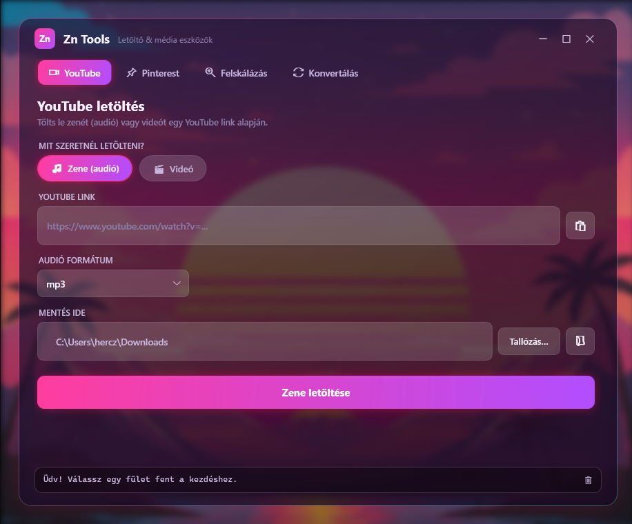

# Zn Tools

A modern **WPF (.NET 8)** desktop media toolkit for Windows — download music and video from **YouTube**, download video from **Pinterest**, convert audio/video/image files, and **upscale videos** either locally (FFmpeg) or with cloud AI (Fal.ai). All wrapped in a custom, frameless "synthwave glass" UI.


## Screenshot

<!-- Add a screenshot of the running app here, e.g. docs/screenshot.png -->


## Features

| Tab | What it does |
| --- | --- |
| ▶ **YouTube** | Download **music** (`mp3` / `m4a` / `wav`) or **video** (Best / 1080p / 720p / 480p / 360p, merged to `mp4`) from any YouTube link. |
| 📌 **Pinterest** | Download video from a Pinterest Pin link (`mp4` or original quality). |
| ✨ **Video Upscaler** | Increase video resolution **locally** with FFmpeg (2×–4×, Lanczos / xBR / Bicubic) or via **Fal.ai** cloud AI models. |
| ⇄ **File Converter** | Convert between 15 audio, video, and image formats (`mp3`, `wav`, `flac`, `mp4`, `mkv`, `webm`, `png`, `jpg`, `ico`, …). |

**Usability niceties:** paste-from-clipboard buttons, one-click "open output folder", drag-and-drop file input, a live download progress bar, a custom frameless window (drag, snap, resize), and a real-time status log.

## Tech stack

- **C# 12 / .NET 8** (`net8.0-windows`)
- **WPF** — fully custom control templates, `WindowChrome`, glassmorphism styling, storyboard animations
- **[yt-dlp](https://github.com/yt-dlp/yt-dlp)** — YouTube / Pinterest downloading
- **[FFmpeg](https://ffmpeg.org/)** — conversion and local upscaling
- **[Fal.ai](https://fal.ai/)** queue API + `HttpClient` / `System.Text.Json` — cloud AI upscaling

## Getting started

### Prerequisites

- Windows 10 / 11
- [.NET 8 SDK](https://dotnet.microsoft.com/download/dotnet/8.0)
- **`yt-dlp.exe`**, **`ffmpeg.exe`** and **`ffprobe.exe`** — these third-party CLI tools are **not** committed to the repository (they are large binaries with their own licenses). The app looks for them next to the built executable (the `bin/Debug/net8.0-windows/` output folder). The easiest way to get them is the bundled `fetch-tools.ps1` script (see below); to install them by hand instead:
  - yt-dlp: <https://github.com/yt-dlp/yt-dlp/releases>
  - FFmpeg (full build): <https://www.gyan.dev/ffmpeg/builds/>

### Build & run

```bash
git clone https://github.com/HMarcell94/Zn.git
cd Zn
```

Fetch the third-party tools into the build output folder (one-time, needs only PowerShell):

```powershell
./fetch-tools.ps1
```

Then build and run:

```bash
dotnet run --project ZnDownloader.csproj
```

> `fetch-tools.ps1` downloads `yt-dlp.exe`, `ffmpeg.exe` and `ffprobe.exe` into `bin/Debug/net8.0-windows/`. It skips anything already present — pass `-Force` to refresh, or `-OutputDir bin/Release/net8.0-windows` for a Release build.

### Cloud upscaling (optional)

The Fal.ai cloud upscaler needs a free API key (no credit card required) from [fal.ai](https://fal.ai/). Paste it into the **Video Upscaler → Fal.ai** field at runtime — it is never stored or committed.

## Project structure

```
ZnDownloader.csproj   # .NET 8 WPF project
App.xaml(.cs)         # App entry point + global crash logging
MainWindow.xaml       # UI: styles, 4 tabs, synthwave glass layout
MainWindow.xaml.cs    # Logic: downloading, conversion, upscaling
fetch-tools.ps1       # Downloads yt-dlp / ffmpeg / ffprobe into the build output
hatterkep.png         # Background image (embedded resource)
icon.ico              # App icon
```

## Disclaimer

This project is for personal and educational use. Respect the Terms of Service and copyright of any platform you download from, and only download content you have the right to.

## License

Released under the [MIT License](LICENSE).
